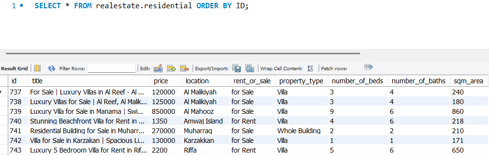

# BahrainPropertyScraper

BahrainPropertyScraper is a Java-based web scraper that extracts residential property listings from [houseme.bh](https://houseme.bh/) and stores the data in a local MySQL database.

## Features
- Scrapes residential property data (title, price, location, details) from house.me.
- Stores the extracted data in a structured MySQL database.
- Handles pagination and dynamic content loading.

## Prerequisites
- Java 11+
- MySQL database
- Selenium (for web scraping, not best choice but chose it just for sake of learning it)
- JDBC driver (for MySQL connectivity)

## Setup
1. Clone the repository:
   ```sh
   git clone https://github.com/yourusername/BahrainPropertyScraper.git
   cd BahrainPropertyScraper
   ```
2. Configure database settings in `.env`:
   ```
   DB_URL=jdbc:mysql://localhost:3306/realestate
   DB_USER=root
   DB_PASSWORD=yourpassword
   ```
3. Build and run the project:
   ```sh
   mvn clean install
   java -jar target/BahrainPropertyScraper.jar
   ```
   in case of problems with selenium package. install and import jar manually.
   

## Usage
- Run the scraper periodically to keep data updated.
- Use SQL queries to analyze the stored property listings.

### Sample Database Output


### Example Property Listing

## License
MIT License

